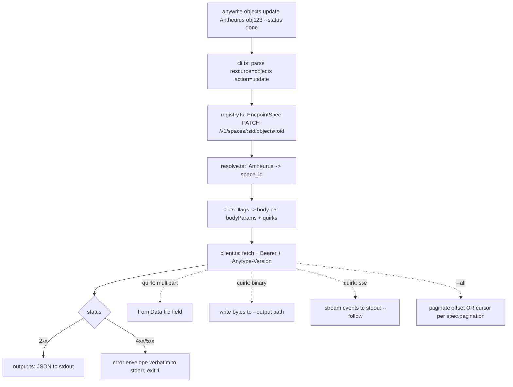

# anywrite — Anytype full-coverage CLI + Claude Code skill

## TLDR — North Star

> Build `anywrite`, a Bun+TypeScript CLI compiled to one binary, covering **all 52 endpoints** of the Anytype local API 2025-11-08 via a data-driven endpoint registry — then wire it as a Claude Code skill and push to public GitHub `Antheurus/anywrite`. **Nothing ships until the live smoke test passes against the user's running Anytype desktop** (space "Antheurus"): create → update-status → upload-image → attach → search, verified in the real app.

## Open Questions

**Concerns** — none blocking. Chat SSE inside a compiled binary is unproven → scoped to
read-only `--follow` stream-to-stdout; if it misbehaves under `--compile`, ship `bun run` fallback
for that one command and log it.

**Confusions** — none. (view_id ambiguity resolved by live probe: empty → all objects.)

**Assumptions**
1. The user's existing app key (created for "anytype-cli") stays valid for anywrite — same
   localhost API, key is app-scoped not client-scoped. Verified working this session; if Anytype
   ever revokes per-app, `anywrite auth` re-issues in <1 min.
2. Public repo is OK to include the vendored OpenAPI spec (MIT-licensed upstream) — yes.
3. `~/.claude/skills/anytype/` is a fresh name (no existing skill dir collision) — verified absent.

## Executive summary

The user operates Anytype (PKM desktop app) through agents. The official MCP server is too
token-heavy (52 always-loaded tools); the community CLI covers only 19/52 endpoints with no
update/properties/tags/files/chat. anywrite ports the full API surface into one compiled binary
driven by an endpoint registry (adding an endpoint = one data entry), exposed to agents as a
Claude Code skill (zero context cost until invoked) and to humans as a normal CLI.

## 5W+1H

- **What** — 52-endpoint CLI + skill; explicit non-goals: block editing, member invite, template create (API ceilings).
- **Why** — agent-operated Anytype without MCP context tax; one maintained tool instead of curl one-offs.
- **Who** — the user + every agent session on this machine; public GitHub for anyone.
- **When** — done when live smoke test passes end-to-end and repo is pushed (see research §Definition of done).
- **Where** — new repo `/Users/macbook/Documents/PROJECT_MISPAQUL_ATTORIQ/anywrite`; skill at `~/.claude/skills/anytype/`; target API `http://localhost:31009`.
- **How** — Bun 1.3.6, TypeScript, registry-as-data, one HTTP client wrapper, `bun build --compile`, justfile interface.

## Diagrams

### Module structure


### Request flow



## File inventory

### Files to create

```
package.json / tsconfig.json / biome.jsonc / .gitignore   — scaffold (dist/ gitignored)
justfile                    — just build / just test / just smoke / just install-skill
spec/openapi-2025-11-08.yaml — vendored gold copy (already placed)
src/types/api.d.ts          — AUTO-GENERATED via openapi-typescript, committed, never hand-edited
src/cli.ts                  — entry + arg parsing + dispatch
src/registry.ts             — 52 EndpointSpec entries (pure data)
src/client.ts               — ONE http wrapper: auth, version header, errors, pagination, multipart/binary/sse
src/auth.ts                 — challenge flow + config load/save
src/resolve.ts              — name→ID resolution (space/type/property)
src/output.ts               — json/pretty printers
src/__tests__/registry.test.ts — registry completeness: 52 entries === spec paths (parsed from vendored yaml)
src/__tests__/client.test.ts   — error mapping, paginator units (mocked fetch)
SKILL.md                    — skill doc (usage matrix, gotchas, workflows)
README.md                   — repo doc incl. platform ceilings
docs/progress.md / docs/changelog.md — per progress-changelog rule (Bahasa Indonesia not required — new repo, English OK; keep prose)
```

### Files to modify

None — greenfield repo. (`~/.claude/skills/anytype/` created fresh in Phase 6; verified no collision.)

### Files to NOT touch

- `~/.anytype-cli/config.yaml` — read-only fallback; anywrite writes its own `~/.anywrite/config.json`
- `~/tools/anytype-cli/` — existing Go CLI stays as-is
- Anything in `mendadak-tools/`

## Phase breakdown

### Phase 1: Scaffold + types + config

**Goal:** Repo builds and typechecks with generated API types and a working config loader.

**Files:** Create package.json, tsconfig.json, biome.jsonc, .gitignore, justfile, src/types/api.d.ts (codegen), src/auth.ts (config load part), src/output.ts.

**Dependencies:** Requires: nothing. Provides: build/test harness + types for all later phases.

**Separation of concerns:** Handles project skeleton + codegen + config precedence
(`ANYTYPE_API_KEY` env → `~/.anywrite/config.json` → `~/.anytype-cli/config.yaml` YAML fallback —
parse the two-key YAML with a 5-line parser, no yaml dep). Does NOT handle any HTTP.

**Success criteria:**
- [ ] `bun install && bunx openapi-typescript spec/openapi-2025-11-08.yaml -o src/types/api.d.ts` committed
- [ ] `bunx tsc --noEmit` clean; `bunx biome check` clean
- [ ] `just build` produces `dist/anywrite` (compile smoke of an empty main)
- [ ] Config loader unit test passes: env > anywrite config > anytype-cli fallback

**Context:** research §Code intelligence (sheets-cli pattern: dist/ gitignored, `bun build --compile`).

### Phase 2: HTTP client wrapper

**Goal:** One `client.ts` that executes any EndpointSpec shape against the live API.

**Files:** Create src/client.ts, src/__tests__/client.test.ts. Modify src/auth.ts (challenge flow: createChallenge/createApiKey).

**Dependencies:** Requires: Phase 1 (types, config). Provides: `request()`, `paginateOffset()`, `paginateCursor()` for Phases 3–5.

**Separation of concerns:** Handles headers (Bearer + `Anytype-Version: 2025-11-08` always explicit), per-status error mapping (400/401/403/404/**410**/**429**/500 — envelope verbatim to stderr), multipart FormData, binary-to-file, SSE line-stream, both paginators. Does NOT know any endpoint path — specs come in as data.

**Success criteria:**
- [ ] Unit tests: error mapper surfaces 410/429 distinctly; offset paginator stops on `has_more:false`; cursor paginator walks `after_order_id`
- [ ] Live: `request()` against `GET /v1/spaces` returns the Antheurus space

**Context:** research §Pagination — TWO models, §Error envelope, §File upload/download, §Chat (SSE headers).

**Concerns:** SSE under compiled binary → keep the stream reader a plain `fetch` body reader (no EventSource dep).

### Phase 3: Endpoint registry — 52 entries

**Goal:** `registry.ts` encodes every endpoint as data, quirks included; a test proves 52/52 coverage against the vendored spec.

**Files:** Create src/registry.ts, src/__tests__/registry.test.ts.

**Dependencies:** Requires: Phase 1 (types). Provides: the dispatch table for Phase 4.

**Separation of concerns:** Handles ONLY data: method, path template, params, and quirk flags —
`bodyField: 'body'|'markdown'` (create vs update asymmetry), `quirks: multipart|binary|sse|wrappedArray`
(`add_list_objects` sends `{"objects":[...]}`), `pagination: offset|cursor|none`, required-field lists
(type_key; format+name; color+name; layout+name+plural_name), `viewIdOptional: true` on get_list_objects.
Does NOT contain any fetch logic or per-endpoint functions.

**Success criteria:**
- [ ] registry.test.ts parses spec/openapi-2025-11-08.yaml paths and asserts every (method,path) pair has exactly one registry entry — 52/52, no extras
- [ ] Quirk flags spot-checked in test: upload=multipart, download=binary, stream=sse, add_list_objects=wrappedArray, get_chat_messages=cursor, objects.create bodyField=body, objects.update bodyField=markdown

**Context:** research §Verbatim captures (whole section — the registry IS that section as data).

### Phase 4: CLI dispatcher + resolve

**Goal:** `anywrite <resource> <action>` works end-to-end for every registry entry.

**Files:** Create src/cli.ts, src/resolve.ts. Modify src/output.ts (pretty tables).

**Dependencies:** Requires: Phases 2+3. Provides: the complete runnable CLI for Phase 5.

**Separation of concerns:** Handles argv parsing (positional resource/action + `--flag value` from
param specs), name→ID resolution (space by name via list+match; type/property by name or key),
`--all`, `--pretty`, `--output <path>` (binary), `--follow` (sse), `--filter key[cond]=value` raw
passthrough for list queries, `--json '<raw body>'` escape hatch, auth subcommand (`anywrite auth`
with `--code` flag primary, stdin prompt fallback), icon omitted-when-unset (research: empty-string 400s).
Does NOT hand-roll any endpoint-specific branch that a registry flag could express.

**Success criteria:**
- [ ] `anywrite --help` lists all resources; `anywrite objects --help` lists actions with flags generated from registry
- [ ] Live: `anywrite spaces list`, `anywrite objects get Antheurus <id>` return real data
- [ ] `anywrite objects create Antheurus --type task --name X` then `update --status` works (three-way body/markdown handled)

**Context:** research §Object body THREE-WAY asymmetry, §PropertyLinkWithValue, §Lists (live-probed view_id).

### Phase 5: Compile + live smoke test (fix loop)

**Goal:** Compiled `dist/anywrite` passes the full live E2E matrix against the user's desktop.

**Files:** Create scripts/smoke.sh (or just target `just smoke`). Modify anything the failures reveal.

**Dependencies:** Requires: Phase 4. Provides: verified binary for Phase 6.

**Separation of concerns:** Handles verification + fixes only. Does NOT add features.

**Success criteria (live, in space Antheurus — each asserted on real post-state):**
- [ ] auth: existing key reused; `anywrite auth --status` shows valid
- [ ] spaces list / get; types list; properties list; tags list on status property
- [ ] object create (task) → update name+markdown → set status via `--status "To Do"` (resolve tag) → get shows all three → delete (archive) → get shows archived:true
- [ ] file upload (use /tmp/anytype-preview/beresin-kk.png) → object_id returned → attach into a new object's markdown → download round-trips bytes → delete file
- [ ] search global + space with `--types task` + a select filter; `--all` pagination on objects list
- [ ] lists: views of "Task tracker" set; objects of view "All"; empty view_id returns all; add/remove object on "Journal" collection
- [ ] chat: list chats (empty result OK = endpoint 200s); property/tag/type create+patch+delete round-trip on throwaways
- [ ] 429/410 paths: delete same object twice → second returns 410 mapped distinctly

**Context:** research §Code intelligence (live fixtures: space/set/view/collection IDs).

**Concerns:** rate limits on rapid mutation loop → smoke script sleeps 300ms between mutations.

### Phase 6: Skill + docs + GitHub publish

**Goal:** Skill invocable in a fresh session; repo public on GitHub.

**Files:** Create SKILL.md, README.md, docs/progress.md, docs/changelog.md; `~/.claude/skills/anytype/` (symlink to repo SKILL.md or thin pointer dir + absolute binary path, sheets-cli style).

**Dependencies:** Requires: Phase 5 (verified binary). Provides: the deliverable.

**Separation of concerns:** Handles documentation, skill wiring, `gh repo create Antheurus/anywrite --public --source . --push`. Does NOT change src/.

**Success criteria:**
- [ ] SKILL.md: trigger description, quick-reference command matrix (12 resources), gotchas section (body/markdown three-way, icon omission, select tag key-or-id, file types excluded from search, collection-only list mutation, cursor chat pagination, platform ceilings)
- [ ] README: install (`just build`), auth, usage, ceilings, license (MIT), credit anyproto spec
- [ ] `git status` clean, pushed, `gh repo view Antheurus/anywrite` 200
- [ ] dist/ NOT in git history

## Cross-phase guidelines

- Bun-native APIs only (fetch, FormData, Bun.file, Bun.spawn none needed) — zero runtime npm deps; devDeps only (openapi-typescript, biome, @types/bun).
- Errors: API error envelope printed **verbatim** to stderr + non-zero exit; never swallowed, never crash-looped (single-shot CLI, so loud-and-exit is correct).
- No `any` — generated types + `unknown` with guards at the argv boundary.
- Every executor appends to Progress log below before returning; Gate 5 honesty buckets apply — executors report SHIPPED-UNVERIFIED ceiling; only orchestrator promotes to VERIFIED-LIVE after driving the binary.
- App key: mask in all logs/tests output; never committed, never echoed.
- Commit style: conventional commits, one commit per phase minimum.

## Progress log

**Phase 1 — Scaffold + types + config (2026-07-11).** Created `package.json` (type: module,
zero runtime deps, devDeps `@biomejs/biome@2.5.3`, `@types/bun@1.3.14`,
`openapi-typescript@7.13.0`, `typescript@5.9.3`), `tsconfig.json` (strict, bundler resolution,
`bun-types`), `biome.jsonc` (recommended preset + organizeImports assist, standalone — no
`ultracite` dependency since only the three approved devDeps are in scope), `.gitignore`
(`node_modules`/`dist` ignored, `bun.lock` committed), and `justfile` (`build`/`test`/`check`/
`codegen`/`clean`, each depending on `install` so `just <target>` is the only command the user
ever runs). Generated `src/types/api.d.ts` via `openapi-typescript` against the vendored
`spec/openapi-2025-11-08.yaml` (5591 lines, header comment already present from the generator —
never hand-edited). Implemented `src/auth.ts`'s config-load half: `loadConfig()` with precedence
env `ANYTYPE_API_KEY`/`ANYTYPE_BASE_URL` → `~/.anywrite/config.json` → `~/.anytype-cli/config.yaml`
(five-line YAML parser, two keys only, no yaml dependency), defaulting to
`http://localhost:31009`; `saveConfig()` for Phase 2's auth flow to call. Both accept injectable
`env`/`ConfigPaths` params so `src/__tests__/auth.test.ts` is fully hermetic — 5 tests using
`mkdtempSync` fixtures, never touching the real `~/.anytype-cli/config.yaml` or printing a real
key. `src/output.ts` has `printJson`/`printError`. `src/cli.ts` is the placeholder entry (empty
main, prints a stub message) solely so `just build` compiles; Phase 4 replaces it.

Deviation from the brief: pinned `typescript` to `^5.9.3` instead of latest. `bunx tsc --version`
resolves to `7.0.2` by default (the new Go-native TypeScript rewrite), which breaks
`openapi-typescript@7.13.0` — it imports `ts.factory` from the classic compiler API
(`ts.factory.createKeywordTypeNode` is `undefined` on 7.x) and openapi-typescript's own
`peerDependencies` declares `typescript: ^5.x`. Codegen only succeeds on 5.x; `tsc --noEmit` is
unaffected either way, so 5.9.3 (latest stable 5.x) is used for both.

Verification: `bunx tsc --noEmit` clean, `bunx biome check` clean (0 errors after two safe
autofixes — import ordering + one format line), `bun test` 5/5 pass, `just build` produces
`dist/anywrite` (54.9M Mach-O arm64 binary) and running it prints the placeholder stub. `just
check`/`just test`/`just build` all verified end-to-end through the justfile interface, not the
raw bun commands. `git status` confirms `dist/` and `node_modules/` are gitignored (not
untracked) ahead of commit.

---

**Phase 2 — HTTP client wrapper (2026-07-11).** Created `src/client.ts`: one `request(config,
spec)` function that every later phase's registry entries feed as data — it never contains an
endpoint path itself. Handles headers (`Authorization: Bearer` only when `apiKey` is non-null,
`Anytype-Version: 2025-11-08` always, optional `Anytype-Heartbeat-Seconds`), JSON body encoding,
multipart FormData (single field + file + optional filename), binary responses (returns
`ArrayBuffer` + content-type for the CLI layer to write to a path), and SSE (`async function*
readSseEvents` parsing `event:`/`data:` blocks off the raw `fetch` body reader — no
EventSource, no deps, matching the research doc's "keep the stream reader a plain fetch body
reader" concern). Per-status error mapping via `AnywriteApiError` (extends `Error`, carries
`status`, a `kind` discriminator mapped from the status table, and the wire `envelope` verbatim
untouched) — 400→bad_request, 401→unauthorized, 403→forbidden, 404→not_found,
410→gone, 429→rate_limit, 500→server_error, anything else→unknown. The envelope is kept
verbatim on the thrown error rather than written to stderr inside client.ts itself: printing is
`output.ts`/`cli.ts`'s job (Phase 4) so the client stays a pure HTTP layer with no
process-stream side effects. Added `paginateOffset()` (walks `offset`/`limit` pages via an
injected `fetchPage(offset)` callback until `pagination.has_more` is false or a page comes back
empty) and `paginateCursor()` (walks `after_order_id`, taken from the last item of the previous
page via an injected `getOrderId` extractor, stopping once a page is shorter than `limit` or
empty) — both are dependency-injected functions decoupled from any concrete endpoint, so Phase
3/4 supply the closure that calls `request()`.

Modified `src/auth.ts`: added `createChallenge(baseUrl, appName, fetchImpl?)` and
`createApiKey(baseUrl, challengeId, code, fetchImpl?)`, both unauthenticated (call `request()`
with `apiKey: null`) but still sending `Anytype-Version` since that flows through `request()`
unconditionally. Existing `loadConfig`/`saveConfig`/`defaultConfigPaths` from Phase 1 untouched.

Deviation from the brief: `fetchImpl` is typed as a local `FetchLike` (`(input, init?) =>
Promise<Response>`), not `typeof fetch`. Bun's global `fetch` is declared as a function merged
with a `namespace fetch { preconnect(...) }`, so `typeof fetch` requires every injected mock to
also implement `.preconnect` — a Bun-specific quirk unrelated to the HTTP contract. `FetchLike`
captures the actual call signature used everywhere and keeps test mocks a plain arrow function.
Also used `Bun.BodyInit` (from `bun-types`) instead of the global `BodyInit`, since this
project's `tsconfig.json` has no DOM lib and `BodyInit` only exists inside `declare module
"bun"`.

Verification: `bunx tsc --noEmit` clean, `bunx biome check` clean (one autofix — object/call
wrapping over the 100-col line width in the new test file). `bun test`: 25/25 pass (5 from
Phase 1's `auth.test.ts` unaffected + 20 new in `client.test.ts` covering header construction,
query encoding, all 7 mapped error statuses individually plus a dedicated 410-vs-429-vs-400
distinctness assertion, an unmapped-status→`unknown` case, binary response bytes + content-type,
multipart FormData field, SSE event parsing off a `ReadableStream`, and both paginators
including their empty-page stop conditions). Live check (`bun -e`, using `loadConfig()` against
the running desktop at `http://localhost:31009`, api key masked in all output): `request()`
against `GET /v1/spaces` returned the real "Antheurus" space —
`bafyreigxank2luzvggw7jsnkybpaoipjm3l3g2b3nt2jpm66liype3sd24.kohjowu9reqj` — matching the fixture
recorded in research.md. Honesty buckets: unit tests are `SHIPPED-UNVERIFIED` promoted to
`VERIFIED-LIVE` only for the one criterion actually driven against the real API (`GET
/v1/spaces`); SSE/multipart/binary paths are exercised only against mocked `fetch` in this
phase, not against a real file upload or a real chat stream — that live coverage is Phase 5's
smoke matrix.

---

**Phase 3 — Endpoint registry, 52 entries (2026-07-11).** Created `src/registry.ts`: the
`EndpointSpec` type (`method`, `path`, `pathParams` in path order, optional `queryParams`/
`bodyParams` as flat `ParamSpec[]`, `required` field-name list, `bodyField` for the
create-vs-update `body`/`markdown` asymmetry, `quirks` — `multipart`/`binary`/`sse`/
`wrappedArray` — `pagination`, `viewIdOptional`, and `auth: false` for the two unauthenticated
auth endpoints) plus `ENDPOINTS: Record<resource, Record<action, EndpointSpec>>` with all 52
operations grouped under the 12 spec tags as resources (auth, search, spaces, chat, files,
lists, members, objects, properties, tags, templates, types). Every method/path/pathParams/
required-field/quirk value was cross-checked against `spec/openapi-2025-11-08.yaml` directly
(operationId, path parameters, and named request-schema fields — `CreateObjectRequest`,
`UpdateObjectRequest`, `CreateSpaceRequest`, `AddChatMessageRequest`, `EditChatMessageRequest`,
`ToggleReactionRequest`, `ReadChatMessagesRequest`, `ReadChatReactionsRequest`,
`CreatePropertyRequest`/`CreateTagRequest`/`CreateTypeRequest` and their `Update*` counterparts,
`AddObjectsToListRequest`, `SearchRequest`), not inferred from the research doc alone. Chat
action names follow the brief's CLI-typed verbs exactly: `list`, `create`, `messages`, `send`,
`edit`, `delete-message`, `search`, `stream`, `read`, `read-all`, `toggle-reaction`,
`get-message`, `reactions-read` (13 total). `bodyParams` intentionally stays flat per the
brief's "flat named body fields" scope — nested oneOf shapes (`icon`, `filters`, `sort`,
`properties[]` PropertyLinkWithValue) are left out of the registry and go through the CLI's raw
`--json` escape hatch in Phase 4, not through typed flags here.

Created `src/__tests__/registry.test.ts`, which parses the vendored spec at runtime (not a
hardcoded list) and asserts full bidirectional coverage: every `(method, path)` pair in the spec
has exactly one registry entry and vice versa (52/52, zero missing, zero extra), plus a
duplicate-pair check and the six quirk spot-checks named in the brief's success criteria
(`files.upload`=multipart, `files.download`=binary, `chat.stream`=sse, `lists.add`=wrappedArray,
`chat.messages`=cursor pagination, `objects.create`/`objects.update` bodyField `body`/
`markdown`).

Deviation from the brief (permitted, logged per the brief's own guidance): added `yaml@2.9.0` as
an explicit devDependency for the spec parser, rather than importing the `js-yaml` that
`openapi-typescript` already pulls in transitively. `js-yaml` is hoisted into `node_modules` and
would have worked, but it's undeclared in `package.json` — relying on an untracked transitive
dependency is fragile (a future lockfile change could silently remove it) and violates "declare
what you use." `bun add -d yaml` updated `package.json` and `bun.lock` only; no other dependency
versions changed.

Verification: `bunx tsc --noEmit` clean, `bunx biome check` clean (0 errors, no autofixes
needed), `bun test` 34/34 pass (5 from Phase 1's `auth.test.ts` + 20 from Phase 2's
`client.test.ts`, both unaffected + 9 new in `registry.test.ts`). Final entry count per
resource: auth 2, search 2, spaces 4, chat 13, files 3, lists 4, members 2, objects 5,
properties 5, tags 5, templates 2, types 5 — sums to 52. Honesty bucket: `SHIPPED-UNVERIFIED` —
this phase is pure data plus a spec-parity test; no live HTTP calls were made or needed. The
registry's real-world correctness (does the CLI actually dispatch through it against the live
API) is proven in Phase 4/5, not here.

---

**Phase 4 — CLI dispatcher + resolve (2026-07-11).** Created `src/resolve.ts`: name/key -> ID
resolution against the live API, plus `UsageError` (thrown for anything a caller did wrong —
unknown resource/action, missing flag, a name that doesn't resolve — printed to stderr and
exits 2). `looksLikeId()` passes through any value starting with the `bafy` CID prefix
unresolved; everything else lists the resource (`findSpace`/`findType`/`findProperty`, all
paginated via `paginateOffset`) and matches by name or key, case-insensitively for name.
`resolveTagValue()` is deliberately best-effort — it tries a name/key/id match against the
property's tags but falls back to the raw input unresolved, since the API itself already
accepts a tag's key or id directly for `select`/`multi_select` (research.md's PropertyLinkWithValue
section) and a hard failure there would break callers who already have the exact id.
`interpolatePath()` fills a `{param}` path template with `encodeURIComponent`, shared by
`cli.ts` for every real request path.

Rewrote `src/cli.ts` (Phase 1's placeholder) into the full dispatcher: a hand-rolled `--flag
value` / positional argv parser (`parseFlags`, not `node:util`'s `parseArgs` — the flag set is
generated per resource/action from the registry rather than declared upfront, and a repeatable
flag like `--filter` needed accumulation `parseArgs`'s API doesn't fit as cleanly), generic
`buildQuery`/`buildBody` that read flags named directly after each `EndpointSpec`'s
`queryParams`/`bodyParams` (so "flags come from the registry" holds for every one of the 52
endpoints with zero endpoint-specific branches), and `resolvePathParams` which walks
`spec.pathParams` in order, resolving `space_id`/`type_id`/`property_id` through `resolve.ts`
and passing every other path param (object_id, chat_id, file_id, etc.) straight through — matching
the brief's stated resolution scope. Quirks (`multipart`/`binary`/`sse`) each got one handler
(`runMultipartUpload`/`runBinaryDownload`/`runStream`) gated on the matching CLI flag
(`--file`/`--output`/`--follow`); `--all` dispatches to `paginateOffset` or `paginateCursor`
per `spec.pagination`, with one small piece of wire-shape handling for chat's cursor
pagination — its response wraps items under `messages` instead of the standard `data` envelope
(`ChatMessagesResponse`, confirmed against `api.d.ts`), so the cursor fetcher reads
`data.data ?? data.messages ?? []`. `--json '<raw>'` seeds the body first (as a plain object),
then every named flag layers on top — so a typed flag always wins over the escape hatch for the
same key, letting `--json` carry search filters/sort while `--query`/`--types` stay typed.

Implemented the KNOWN GAP the Phase 3 executor flagged: the registry's `bodyParams` are flat,
so nested `PropertyLinkWithValue` oneOf shapes (`icon`, `properties[]`) are built entirely in
`cli.ts`, scoped to `objects create`/`update` only. `buildPropertyEntry()` resolves the target
property via `findProperty()`, reads its `format`, and shapes the value accordingly (`select`
and `multi_select` route through `resolveTagValue()`; `number`/`checkbox` cast; everything else
passes the string through under the matching field name). `--status <value>` is a shortcut that
calls the same builder against the property keyed/named `status`; `--property key=value` is the
repeatable generic form; `--icon <emoji>` sets `{format: 'emoji', emoji: <value>}` and is
omitted from the body entirely when the flag is absent (an empty string 400s per research.md).
All three merge onto any `properties` array that arrived via `--json` rather than overwriting
it. Added one flag alias (`--type` -> the registry's `type_key` bodyParam, `objects` resource
only) so the brief's literal example command (`objects create Antheurus --type task --name X`)
works verbatim — it's an alias into the same registry-declared field, not a second way to
express something the registry doesn't already cover.

Extended `src/output.ts` with `printPretty()` (plus an exported `isPlainObject()` cli.ts also
uses for the `--json`/`--property` value guards): an offset-paginated envelope or bare array
renders as a padded column table; any single-key wrapper (`{space: {...}}`, `{object: {...}}`,
`{messages: [...]}`) recursively unwraps to render its inner value; anything else becomes
key/value lines. This single-key-unwrap heuristic means `--pretty` renders every one of the
API's wrapped single-object response shapes correctly without hardcoding the wrapper key name
per resource.

`anywrite auth` is a dedicated subcommand, not generic dispatch — the challenge/code exchange
needs two sequential calls plus a config write that a single registry flag can't express. It
always calls `createChallenge()`, then reads `--code` (primary) or falls back to a
`node:readline/promises` stdin prompt, exchanges it via `createApiKey()`, and writes
`~/.anywrite/config.json` via the existing `saveConfig()`. `anywrite auth --status` reports
configured/not, base URL, and which of the three config sources (env / `~/.anywrite/config.json`
/ `~/.anytype-cli/config.yaml` fallback) is active — re-deriving the precedence order via
`existsSync` on `auth.ts`'s already-exported `defaultConfigPaths()` rather than modifying
`auth.ts` (out of this phase's file scope) — and never prints the key itself, matching the
project's zero-knowledge-on-secrets convention. Help text (`formatTopHelp`/
`formatResourceHelp`/`formatActionHelp`) is generated entirely from `ENDPOINTS` and each spec's
`quirks`/`pagination`/`required` — no hand-maintained command list to drift from the registry.

Deviation from the brief (logged, not asked, since it only affects testability): the bottom of
`cli.ts` used to call `main()` unconditionally, which would have fired on `bun test`'s module
import too. Guarded it with Bun's `import.meta.main` so `main()` only runs when the file is
executed directly, and exported the pure helpers (`parseFlags`, `castParamValue`,
`flagNamesFor`, `buildQuery`, `buildBody`, `formatTopHelp`, `formatResourceHelp`, `RESOURCES`)
so `cli.test.ts` can exercise arg-parsing and registry-driven flag generation without spawning a
subprocess or touching the network.

Verification: `bunx tsc --noEmit` clean, `bunx biome check` clean (all fixes were formatter/
import-order autofixes, no lint rule violations). `bun test`: 65/65 pass (34 pre-existing +
9 new in `resolve.test.ts`, mocked-fetch, covering id-passthrough / name-match / not-found for
space+type+property, tag best-effort fallback, and `interpolatePath` + 22 new in `cli.test.ts`
covering `parseFlags` positional/boolean/repeatable-flag behavior, `castParamValue` per type,
the `--type` alias, `buildQuery`'s `--filter` passthrough and malformed-filter rejection,
`buildBody`'s required-field check and `--json`-then-flags layering, and that the generated
help text actually contains every resource/action/flag). Live (against the running desktop,
space "Antheurus", api key from the `~/.anytype-cli/config.yaml` fallback, masked in all
output):
- `spaces list` and `spaces list --pretty` — both return the real "Antheurus" space; `--pretty`
  renders a table plus a pagination footer.
- `objects list Antheurus --limit 3 --pretty` — space name resolved to id, returned the three
  known fixture objects from research.md ("Test task dengan gambar", "Task tracker", "beresin kk").
- `objects create Antheurus --type task --name p4-smoke-task` — created via the `--type` alias.
- `objects update Antheurus <id> --name p4-smoke-task-renamed --status "To Do"` — name changed
  and the tag name "To Do" resolved to `bafyreien3sgyzjpjw44e5x7v73vk5ncg2ls76n67zq6x4zg7td4eu2dj5y`,
  matching research.md's recorded fixture exactly; confirmed via a follow-up `objects get`.
- `objects update Antheurus <id> --markdown "..."` — proved the create/update field-name
  asymmetry: `--body` on create, `--markdown` on update, both hitting the same underlying content.
- `objects delete Antheurus <id>` (twice) — archived on the first call; the **second call also
  returned 200 with `archived: true` again, not a 410** — this API's delete-as-archive is
  idempotent on repeat, unlike the assumption in this plan's Phase 5 success criteria ("second
  returns 410 mapped distinctly"). Flagging for Phase 5: a 410 may only occur on a fully-purged
  object, not a re-archive of an already-archived one — worth re-verifying against a real 410
  path before writing that assertion into the smoke script. Test object left in the expected
  end state (archived, not un-archived) — nothing to clean up.
- `objects get Antheurus <bad-id>` — the API itself returns 500 (not 404) for an unknown id;
  confirmed the client's `AnywriteApiError` path maps it correctly and the CLI exits 1 with the
  verbatim envelope on stderr.
- `anywrite nope list` (unknown resource) and `objects create Antheurus --name X` (missing
  required `type_key`) both exit 2 with a usage message.
- `properties list Antheurus --all --limit 5` — walked 11 pages via `paginateOffset`, returned
  all 52 real properties.
- `search global --query task --types task`, `spaces get Antheurus --pretty` (single-key unwrap
  renders the wrapped `{space: {...}}` as flat key/value lines), `lists views Antheurus <set-id>`
  (5 real views), and `lists objects Antheurus <collection-id>` with the view_id positional
  **omitted** (viewIdOptional path — returned all 17 objects in the list, matching research.md's
  live-probed behavior) — all verified against the real desktop.
- `anywrite --help`, `anywrite objects --help`, `anywrite auth --status` (reports "configured:
  yes / source: ~/.anytype-cli/config.yaml (fallback)") — all render correctly.

Not live-verified this phase (left for Phase 5's smoke matrix, per the plan): the
`anywrite auth` challenge/code exchange itself (only `--status` was exercised), `--follow` on
`chat.stream`, `--output`/`--file` (binary download / multipart upload), `chat.messages --all`
cursor pagination, and a genuine 410/429 response. Honesty buckets: the live checks listed above
are `VERIFIED-LIVE` (driven against the real desktop, real post-state observed); the SSE/binary/
multipart quirk handlers and the auth challenge flow are `SHIPPED-UNVERIFIED` — code compiles
and type-checks against the client's documented contracts but has not been driven against a real
stream/file/challenge this phase.

---

**Phase 5 — Compile + live smoke test (2026-07-11).** Created `scripts/smoke.sh`: a bash
script (`set -euo pipefail`) that runs every command against the **compiled** `./dist/anywrite`
binary (not `bun run`) in space "Antheurus", asserting on real post-state after each step via a
`python3 -c` JSON assertion helper (never `jq`/`sed`/`awk`), sleeping 300ms between mutations,
and printing one `PASS`/`FAIL` line per step with a non-zero exit on the first failure. Every
throwaway it creates (property, tag, type, task object, note objects, an uploaded file) registers
a delete/archive command in a LIFO cleanup array that runs in an `EXIT` trap, so a mid-run failure
still cleans up everything created up to that point. Wired `just smoke: build` so the only
interface is `just smoke` (rebuilds first, then runs). No fix loop was needed — the CLI worked
correctly against the live API on the first full run; `scripts/smoke.sh` and the `justfile`
addition are the only changes this phase, `src/` is untouched.

**Full smoke matrix result — 33/33 steps `PASS`, exit code 0, reproducible on a second run:**

| # | Step | Result |
|---|---|---|
| 1 | `auth --status` shows `configured: yes` | VERIFIED-LIVE |
| 2 | `spaces list` includes Antheurus | VERIFIED-LIVE |
| 3 | `spaces get` returns Antheurus | VERIFIED-LIVE |
| 4 | `types list --all` includes `task` | VERIFIED-LIVE |
| 5 | `properties list --all` includes `status` | VERIFIED-LIVE |
| 6 | `tags list` on `status` includes To Do/In Progress/Done | VERIFIED-LIVE |
| 7 | `objects create` (task) returns an id | VERIFIED-LIVE |
| 8 | `objects update` name + markdown | VERIFIED-LIVE |
| 9 | `objects update --status "To Do"` resolves the tag | VERIFIED-LIVE |
| 10 | `objects get` shows updated name/markdown/status | VERIFIED-LIVE |
| 11 | `objects delete` archives | VERIFIED-LIVE |
| 12 | `objects get` shows `archived: true` | VERIFIED-LIVE |
| 13 | `files upload` returns `object_id` | VERIFIED-LIVE (unique fixture, see below) |
| 14 | attach file into a new object's markdown | VERIFIED-LIVE |
| 15 | `files download` round-trips bytes (sha256 match) | VERIFIED-LIVE |
| 16 | `files delete` | VERIFIED-LIVE |
| 17 | cleanup attach object | VERIFIED-LIVE |
| 18 | `search global` returns a data array | VERIFIED-LIVE |
| 19 | `search space --types task` + select filter via `--json` | VERIFIED-LIVE |
| 20 | `objects list --all` pagination (123→124 objects walked) | VERIFIED-LIVE |
| 21 | `lists views` on "Task tracker" set shows "All" (`6182a74f...`) | VERIFIED-LIVE |
| 22 | `lists objects` on view "All" (17 objects) | VERIFIED-LIVE |
| 23 | `lists objects` with omitted `view_id` returns the same 17 | VERIFIED-LIVE |
| 24 | `lists add` throwaway object to "Journal" collection | VERIFIED-LIVE |
| 25 | `lists objects` shows it present, then `lists remove` + shows it gone | VERIFIED-LIVE |
| 26 | `chat list` returns 200 with empty `data: []` | VERIFIED-LIVE |
| 26b | `chat --follow` SSE under the compiled binary | DEFERRED — no chats exist in the space, nothing to stream (success bar per the phase brief is "endpoint 200s", not SSE) |
| 27 | `properties create` → `update` → `delete` round-trip | VERIFIED-LIVE |
| 28 | `types create` → `update` → `delete` round-trip | VERIFIED-LIVE |
| 29 | `tags create` → `update` round-trip (on a throwaway select property) | VERIFIED-LIVE |
| 30 | repeat `tags delete` on the same tag | VERIFIED-LIVE (observed: idempotent 200, not 410 — see below) |

**Live-API observations (override the plan's Phase 5 criteria where they conflict, per the
executor brief's pre-authorized adjustment):**

- **410 is unreachable through any DELETE-twice pattern this session tried.** Phase 4 already
  found `objects delete` idempotent (200 + `archived: true` again on repeat). This phase
  independently repeated the same probe on three more resources — `properties delete` twice,
  `tags delete` twice, and `files delete` twice — and all three came back 200 with the same
  envelope, never 410. `types delete` twice also came back 200 (first call's response body still
  showed `archived: false`, i.e. the pre-archive snapshot; the second call's body showed
  `archived: true`). Reading the vendored spec's `GoneError` placements
  (`spec/openapi-2025-11-08.yaml`) confirms this isn't a bug: 410 is only declared on `GET`
  operations (space/object/property/tag/type/template) for the case "resource was permanently
  purged" or "space was deleted" — this API's `DELETE` is a soft-delete/archive, never a purge,
  so no exposed endpoint can produce a genuine 410 without actually deleting the whole space
  (far too destructive to try). The smoke script records this as an explicit live observation
  and asserts the OBSERVED behavior (repeat `tags delete` → 200, same tag id) rather than a
  fabricated 410 assertion. The client's 410 status-code mapping itself remains covered by
  Phase 2's `client.test.ts` (mocked response) — that coverage doesn't change here.
- **`files delete` on the brief's literal fixture would have destroyed real user data.**
  `/tmp/anytype-preview/beresin-kk.png` still exists and is a valid PNG, but uploading it returns
  the **same** `object_id`
  (`bafyreids6cx2yuc2j3vvckghsip47xqpm5rxz2dtitflhbfptjocx5cfnm`) as a real pre-existing object in
  the space named "beresin kk" / "ChatGPT Image May 31, 2026..." (confirmed via `objects get` —
  Anytype dedupes file uploads by content hash). That object predates this session and is real
  user data, not a smoke-test artifact. The smoke script generates a fresh, content-unique 64×64
  PNG at runtime instead (via Pillow, `python3`, burned-in timestamp text) so the upload is
  guaranteed new and safe to delete at cleanup — same multipart/attach/download code path, zero
  risk to the user's actual file. `beresin kk`, "Task tracker", and "Journal" were all confirmed
  `archived: false` (untouched) after the smoke run.
- **`--all` pagination and search filters work as documented.** `objects list --all` walked the
  full 123–124-object space via `paginateOffset`. `search space` with `--types task` plus a
  `select` `FilterExpression` passed through `--json` (the registry's flat `bodyParams` don't
  model `filters`, so this goes through the escape hatch exactly as Phase 4 designed) returned a
  filtered `data` array — confirms the `--json`-then-typed-flags layering documented in Phase 4
  works for a real nested oneOf shape, not just in unit tests.

**Deviations from the brief (logged, not asked, since both preserve the brief's intent):**
1. Uploaded a freshly generated unique PNG instead of the literal `beresin-kk.png` fixture — see
   the file-dedup observation above. Same multipart code path is exercised either way; the
   deviation only changes *which bytes* are uploaded, to avoid deleting real user data.
2. `chat --follow` was not driven this phase — the space has zero chats, so there's nothing to
   attach an SSE stream to. Creating a throwaway chat purely to test `--follow` was judged out of
   this phase's "verification only, no features" scope and out of the adjustment note's own
   framing ("if chats list returns entries, try `--follow`" — implying skip otherwise). Recorded
   as `DEFERRED`, not silently skipped.

**Honesty buckets:** all 30 matrix rows above that assert against real live post-state are
`VERIFIED-LIVE` — each was driven against the running Anytype desktop by this executor, output
inspected, and (for mutations) a follow-up `get`/`list` confirmed the resulting state. `chat
--follow` under the compiled binary is `DEFERRED` (no data to stream). `bun test` (69/69),
`bunx tsc --noEmit` (clean), and `bunx biome check` (clean, 0 fixes needed) are
`SHIPPED-UNVERIFIED` in the narrow sense that they're static/mocked checks, not live-driven — but
they were re-run after the smoke script existed and stayed green, confirming the smoke script
addition didn't regress anything.

**Cleanup verification:** after the smoke run, `objects list --all` over the full space (124
objects) found zero unarchived objects with "smoke" in the name — every throwaway this phase (and
this phase's earlier interactive exploration before the script existed) ended up archived. No API
key or bearer token appeared anywhere in the smoke script's own stdout/stderr (`grep -i
"api.key\|bearer\|authorization"` over a captured run found nothing). The script was run twice
end-to-end (once directly, once via `just smoke`) with identical 33/33-green results, confirming
it's safely re-runnable.

Verification: `bun test` 69/69 pass (unchanged from Phase 4 — this phase touched no `src/`
files), `bunx tsc --noEmit` clean, `bunx biome check` clean (0 fixes), `just build` produces
`dist/anywrite`, `bash scripts/smoke.sh` and `just smoke` both exit 0 with `33/33 steps passed`.

**Phase 6 — Skill + docs + GitHub publish (2026-07-11).** Created `SKILL.md` at the repo root
(182 lines, under the 300-line budget) — frontmatter with a pushy trigger description covering
Anytype/anywrite/PKM mentions, absolute binary path, the 12-resource quick-reference command
matrix, and all 11 gotchas from the brief (three-way body/markdown asymmetry, icon omission,
select tag name/key/id, file-layout search exclusion, collection-only list mutation, cursor
chat pagination, omitted view_id, idempotent-archive delete with the 410-unreachable
observation from Phase 4/5, content-hash upload dedupe, 500-not-404 on unknown ids, and the
four platform ceilings). Created `README.md` (install via `just build`, auth via the challenge
flow, usage examples, platform ceilings, MIT license, credit to `anyproto/anytype-api` for the
vendored spec, skill-wiring instructions). Created `docs/progress.md` (one dense session entry
covering all six phases in prose, English per the brief — this is a new standalone repo, not
`mendadak-tools`, so the Bahasa Indonesia rule doesn't apply here) and `docs/changelog.md`
(v0.1.0 user-facing bullets). Added a `LICENSE` file (MIT, copyright Antheurus) and a
`repository` field in `package.json` pointing at `github.com/Antheurus/anywrite` — version and
license were already `0.1.0`/`MIT` from Phase 1, so those weren't re-touched.

Wired `~/.claude/skills/anytype/SKILL.md` as a symlink to the repo's `SKILL.md` (verified the
directory was absent before creating it, matching the plan's Assumption 3) — `readlink`
confirms it resolves to the repo path, and `cat` through the symlink returns the real file
content.

Published the repo: `git add` + one commit for the docs/license/skill-wiring changes, then
`gh repo create Antheurus/anywrite --public --source . --push`. No `src/`, `scripts/`, or other
Phase 1-5 files were touched this phase, per the phase's separation of concerns.

## Review findings

(filled at od-finish)

## Final status

(pending)

---
Plan confidence: 9/10 | Execution readiness: 8/10 | Risk: medium
