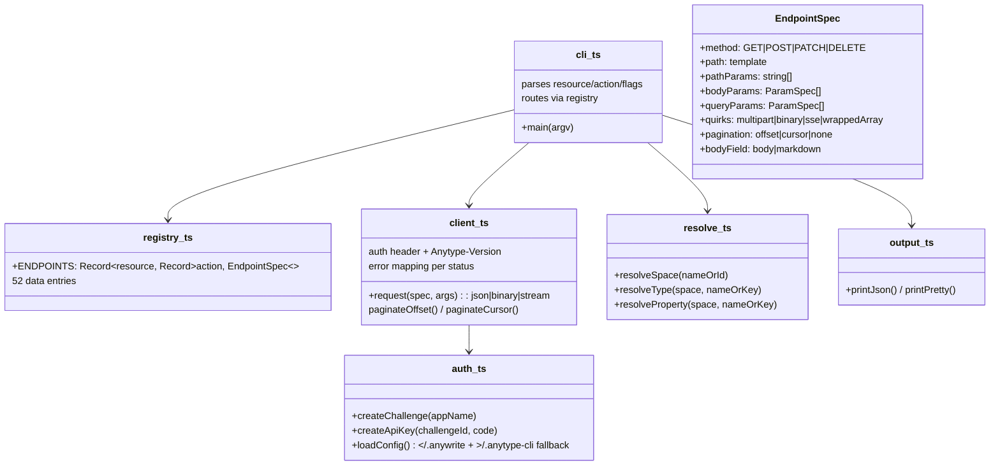
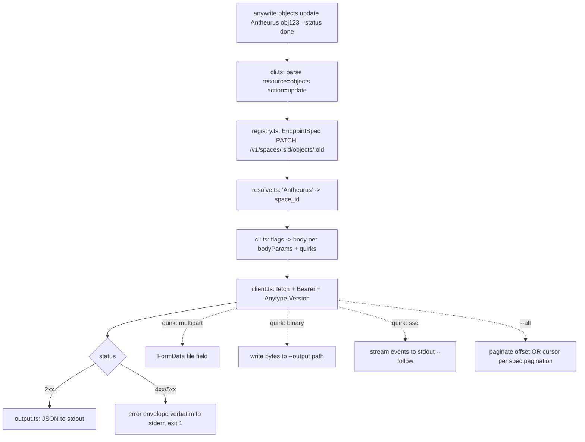

# anywrite — Anytype full-coverage CLI + Claude Code skill

## TLDR — North Star

> Build `anywrite`, a Bun+TypeScript CLI compiled to one binary, covering **all 52 endpoints** of the Anytype local API 2025-11-08 via a data-driven endpoint registry — then wire it as a Claude Code skill and push to public GitHub `Antheurus/anywrite`. **Nothing ships until the live smoke test passes against the user's running Anytype desktop** (space "Antheurus"): create → update-status → upload-image → attach → search, verified in the real app.

## Open Questions

**Concerns** — none blocking. Chat SSE inside a compiled binary is unproven → scoped to
read-only `--follow` stream-to-stdout; if it misbehaves under `--compile`, ship `bun run` fallback
for that one command and log it.

**Confusions** — none. (view_id ambiguity resolved by live probe: empty → all objects.)

**Assumptions**
1. The user's existing app key (created for "anytype-cli") stays valid for anywrite — same
   localhost API, key is app-scoped not client-scoped. Verified working this session; if Anytype
   ever revokes per-app, `anywrite auth` re-issues in <1 min.
2. Public repo is OK to include the vendored OpenAPI spec (MIT-licensed upstream) — yes.
3. `~/.claude/skills/anytype/` is a fresh name (no existing skill dir collision) — verified absent.

## Executive summary

The user operates Anytype (PKM desktop app) through agents. The official MCP server is too
token-heavy (52 always-loaded tools); the community CLI covers only 19/52 endpoints with no
update/properties/tags/files/chat. anywrite ports the full API surface into one compiled binary
driven by an endpoint registry (adding an endpoint = one data entry), exposed to agents as a
Claude Code skill (zero context cost until invoked) and to humans as a normal CLI.

## 5W+1H

- **What** — 52-endpoint CLI + skill; explicit non-goals: block editing, member invite, template create (API ceilings).
- **Why** — agent-operated Anytype without MCP context tax; one maintained tool instead of curl one-offs.
- **Who** — the user + every agent session on this machine; public GitHub for anyone.
- **When** — done when live smoke test passes end-to-end and repo is pushed (see research §Definition of done).
- **Where** — new repo `/Users/macbook/Documents/PROJECT_MISPAQUL_ATTORIQ/anywrite`; skill at `~/.claude/skills/anytype/`; target API `http://localhost:31009`.
- **How** — Bun 1.3.6, TypeScript, registry-as-data, one HTTP client wrapper, `bun build --compile`, justfile interface.

## Diagrams

### Module structure



### Request flow



## File inventory

### Files to create

```
package.json / tsconfig.json / biome.jsonc / .gitignore   — scaffold (dist/ gitignored)
justfile                    — just build / just test / just smoke / just install-skill
spec/openapi-2025-11-08.yaml — vendored gold copy (already placed)
src/types/api.d.ts          — AUTO-GENERATED via openapi-typescript, committed, never hand-edited
src/cli.ts                  — entry + arg parsing + dispatch
src/registry.ts             — 52 EndpointSpec entries (pure data)
src/client.ts               — ONE http wrapper: auth, version header, errors, pagination, multipart/binary/sse
src/auth.ts                 — challenge flow + config load/save
src/resolve.ts              — name→ID resolution (space/type/property)
src/output.ts               — json/pretty printers
src/__tests__/registry.test.ts — registry completeness: 52 entries === spec paths (parsed from vendored yaml)
src/__tests__/client.test.ts   — error mapping, paginator units (mocked fetch)
SKILL.md                    — skill doc (usage matrix, gotchas, workflows)
README.md                   — repo doc incl. platform ceilings
docs/progress.md / docs/changelog.md — per progress-changelog rule (Bahasa Indonesia not required — new repo, English OK; keep prose)
```

### Files to modify

None — greenfield repo. (`~/.claude/skills/anytype/` created fresh in Phase 6; verified no collision.)

### Files to NOT touch

- `~/.anytype-cli/config.yaml` — read-only fallback; anywrite writes its own `~/.anywrite/config.json`
- `~/tools/anytype-cli/` — existing Go CLI stays as-is
- Anything in `mendadak-tools/`

## Phase breakdown

### Phase 1: Scaffold + types + config

**Goal:** Repo builds and typechecks with generated API types and a working config loader.

**Files:** Create package.json, tsconfig.json, biome.jsonc, .gitignore, justfile, src/types/api.d.ts (codegen), src/auth.ts (config load part), src/output.ts.

**Dependencies:** Requires: nothing. Provides: build/test harness + types for all later phases.

**Separation of concerns:** Handles project skeleton + codegen + config precedence
(`ANYTYPE_API_KEY` env → `~/.anywrite/config.json` → `~/.anytype-cli/config.yaml` YAML fallback —
parse the two-key YAML with a 5-line parser, no yaml dep). Does NOT handle any HTTP.

**Success criteria:**
- [ ] `bun install && bunx openapi-typescript spec/openapi-2025-11-08.yaml -o src/types/api.d.ts` committed
- [ ] `bunx tsc --noEmit` clean; `bunx biome check` clean
- [ ] `just build` produces `dist/anywrite` (compile smoke of an empty main)
- [ ] Config loader unit test passes: env > anywrite config > anytype-cli fallback

**Context:** research §Code intelligence (sheets-cli pattern: dist/ gitignored, `bun build --compile`).

### Phase 2: HTTP client wrapper

**Goal:** One `client.ts` that executes any EndpointSpec shape against the live API.

**Files:** Create src/client.ts, src/__tests__/client.test.ts. Modify src/auth.ts (challenge flow: createChallenge/createApiKey).

**Dependencies:** Requires: Phase 1 (types, config). Provides: `request()`, `paginateOffset()`, `paginateCursor()` for Phases 3–5.

**Separation of concerns:** Handles headers (Bearer + `Anytype-Version: 2025-11-08` always explicit), per-status error mapping (400/401/403/404/**410**/**429**/500 — envelope verbatim to stderr), multipart FormData, binary-to-file, SSE line-stream, both paginators. Does NOT know any endpoint path — specs come in as data.

**Success criteria:**
- [ ] Unit tests: error mapper surfaces 410/429 distinctly; offset paginator stops on `has_more:false`; cursor paginator walks `after_order_id`
- [ ] Live: `request()` against `GET /v1/spaces` returns the Antheurus space

**Context:** research §Pagination — TWO models, §Error envelope, §File upload/download, §Chat (SSE headers).

**Concerns:** SSE under compiled binary → keep the stream reader a plain `fetch` body reader (no EventSource dep).

### Phase 3: Endpoint registry — 52 entries

**Goal:** `registry.ts` encodes every endpoint as data, quirks included; a test proves 52/52 coverage against the vendored spec.

**Files:** Create src/registry.ts, src/__tests__/registry.test.ts.

**Dependencies:** Requires: Phase 1 (types). Provides: the dispatch table for Phase 4.

**Separation of concerns:** Handles ONLY data: method, path template, params, and quirk flags —
`bodyField: 'body'|'markdown'` (create vs update asymmetry), `quirks: multipart|binary|sse|wrappedArray`
(`add_list_objects` sends `{"objects":[...]}`), `pagination: offset|cursor|none`, required-field lists
(type_key; format+name; color+name; layout+name+plural_name), `viewIdOptional: true` on get_list_objects.
Does NOT contain any fetch logic or per-endpoint functions.

**Success criteria:**
- [ ] registry.test.ts parses spec/openapi-2025-11-08.yaml paths and asserts every (method,path) pair has exactly one registry entry — 52/52, no extras
- [ ] Quirk flags spot-checked in test: upload=multipart, download=binary, stream=sse, add_list_objects=wrappedArray, get_chat_messages=cursor, objects.create bodyField=body, objects.update bodyField=markdown

**Context:** research §Verbatim captures (whole section — the registry IS that section as data).

### Phase 4: CLI dispatcher + resolve

**Goal:** `anywrite <resource> <action>` works end-to-end for every registry entry.

**Files:** Create src/cli.ts, src/resolve.ts. Modify src/output.ts (pretty tables).

**Dependencies:** Requires: Phases 2+3. Provides: the complete runnable CLI for Phase 5.

**Separation of concerns:** Handles argv parsing (positional resource/action + `--flag value` from
param specs), name→ID resolution (space by name via list+match; type/property by name or key),
`--all`, `--pretty`, `--output <path>` (binary), `--follow` (sse), `--filter key[cond]=value` raw
passthrough for list queries, `--json '<raw body>'` escape hatch, auth subcommand (`anywrite auth`
with `--code` flag primary, stdin prompt fallback), icon omitted-when-unset (research: empty-string 400s).
Does NOT hand-roll any endpoint-specific branch that a registry flag could express.

**Success criteria:**
- [ ] `anywrite --help` lists all resources; `anywrite objects --help` lists actions with flags generated from registry
- [ ] Live: `anywrite spaces list`, `anywrite objects get Antheurus <id>` return real data
- [ ] `anywrite objects create Antheurus --type task --name X` then `update --status` works (three-way body/markdown handled)

**Context:** research §Object body THREE-WAY asymmetry, §PropertyLinkWithValue, §Lists (live-probed view_id).

### Phase 5: Compile + live smoke test (fix loop)

**Goal:** Compiled `dist/anywrite` passes the full live E2E matrix against the user's desktop.

**Files:** Create scripts/smoke.sh (or just target `just smoke`). Modify anything the failures reveal.

**Dependencies:** Requires: Phase 4. Provides: verified binary for Phase 6.

**Separation of concerns:** Handles verification + fixes only. Does NOT add features.

**Success criteria (live, in space Antheurus — each asserted on real post-state):**
- [ ] auth: existing key reused; `anywrite auth --status` shows valid
- [ ] spaces list / get; types list; properties list; tags list on status property
- [ ] object create (task) → update name+markdown → set status via `--status "To Do"` (resolve tag) → get shows all three → delete (archive) → get shows archived:true
- [ ] file upload (use /tmp/anytype-preview/beresin-kk.png) → object_id returned → attach into a new object's markdown → download round-trips bytes → delete file
- [ ] search global + space with `--types task` + a select filter; `--all` pagination on objects list
- [ ] lists: views of "Task tracker" set; objects of view "All"; empty view_id returns all; add/remove object on "Journal" collection
- [ ] chat: list chats (empty result OK = endpoint 200s); property/tag/type create+patch+delete round-trip on throwaways
- [ ] 429/410 paths: delete same object twice → second returns 410 mapped distinctly

**Context:** research §Code intelligence (live fixtures: space/set/view/collection IDs).

**Concerns:** rate limits on rapid mutation loop → smoke script sleeps 300ms between mutations.

### Phase 6: Skill + docs + GitHub publish

**Goal:** Skill invocable in a fresh session; repo public on GitHub.

**Files:** Create SKILL.md, README.md, docs/progress.md, docs/changelog.md; `~/.claude/skills/anytype/` (symlink to repo SKILL.md or thin pointer dir + absolute binary path, sheets-cli style).

**Dependencies:** Requires: Phase 5 (verified binary). Provides: the deliverable.

**Separation of concerns:** Handles documentation, skill wiring, `gh repo create Antheurus/anywrite --public --source . --push`. Does NOT change src/.

**Success criteria:**
- [ ] SKILL.md: trigger description, quick-reference command matrix (12 resources), gotchas section (body/markdown three-way, icon omission, select tag key-or-id, file types excluded from search, collection-only list mutation, cursor chat pagination, platform ceilings)
- [ ] README: install (`just build`), auth, usage, ceilings, license (MIT), credit anyproto spec
- [ ] `git status` clean, pushed, `gh repo view Antheurus/anywrite` 200
- [ ] dist/ NOT in git history

## Cross-phase guidelines

- Bun-native APIs only (fetch, FormData, Bun.file, Bun.spawn none needed) — zero runtime npm deps; devDeps only (openapi-typescript, biome, @types/bun).
- Errors: API error envelope printed **verbatim** to stderr + non-zero exit; never swallowed, never crash-looped (single-shot CLI, so loud-and-exit is correct).
- No `any` — generated types + `unknown` with guards at the argv boundary.
- Every executor appends to Progress log below before returning; Gate 5 honesty buckets apply — executors report SHIPPED-UNVERIFIED ceiling; only orchestrator promotes to VERIFIED-LIVE after driving the binary.
- App key: mask in all logs/tests output; never committed, never echoed.
- Commit style: conventional commits, one commit per phase minimum.

## Progress log

**Phase 1 — Scaffold + types + config (2026-07-11).** Created `package.json` (type: module,
zero runtime deps, devDeps `@biomejs/biome@2.5.3`, `@types/bun@1.3.14`,
`openapi-typescript@7.13.0`, `typescript@5.9.3`), `tsconfig.json` (strict, bundler resolution,
`bun-types`), `biome.jsonc` (recommended preset + organizeImports assist, standalone — no
`ultracite` dependency since only the three approved devDeps are in scope), `.gitignore`
(`node_modules`/`dist` ignored, `bun.lock` committed), and `justfile` (`build`/`test`/`check`/
`codegen`/`clean`, each depending on `install` so `just <target>` is the only command the user
ever runs). Generated `src/types/api.d.ts` via `openapi-typescript` against the vendored
`spec/openapi-2025-11-08.yaml` (5591 lines, header comment already present from the generator —
never hand-edited). Implemented `src/auth.ts`'s config-load half: `loadConfig()` with precedence
env `ANYTYPE_API_KEY`/`ANYTYPE_BASE_URL` → `~/.anywrite/config.json` → `~/.anytype-cli/config.yaml`
(five-line YAML parser, two keys only, no yaml dependency), defaulting to
`http://localhost:31009`; `saveConfig()` for Phase 2's auth flow to call. Both accept injectable
`env`/`ConfigPaths` params so `src/__tests__/auth.test.ts` is fully hermetic — 5 tests using
`mkdtempSync` fixtures, never touching the real `~/.anytype-cli/config.yaml` or printing a real
key. `src/output.ts` has `printJson`/`printError`. `src/cli.ts` is the placeholder entry (empty
main, prints a stub message) solely so `just build` compiles; Phase 4 replaces it.

Deviation from the brief: pinned `typescript` to `^5.9.3` instead of latest. `bunx tsc --version`
resolves to `7.0.2` by default (the new Go-native TypeScript rewrite), which breaks
`openapi-typescript@7.13.0` — it imports `ts.factory` from the classic compiler API
(`ts.factory.createKeywordTypeNode` is `undefined` on 7.x) and openapi-typescript's own
`peerDependencies` declares `typescript: ^5.x`. Codegen only succeeds on 5.x; `tsc --noEmit` is
unaffected either way, so 5.9.3 (latest stable 5.x) is used for both.

Verification: `bunx tsc --noEmit` clean, `bunx biome check` clean (0 errors after two safe
autofixes — import ordering + one format line), `bun test` 5/5 pass, `just build` produces
`dist/anywrite` (54.9M Mach-O arm64 binary) and running it prints the placeholder stub. `just
check`/`just test`/`just build` all verified end-to-end through the justfile interface, not the
raw bun commands. `git status` confirms `dist/` and `node_modules/` are gitignored (not
untracked) ahead of commit.

## Review findings

(filled at od-finish)

## Final status

(pending)

---
Plan confidence: 9/10 | Execution readiness: 8/10 | Risk: medium
